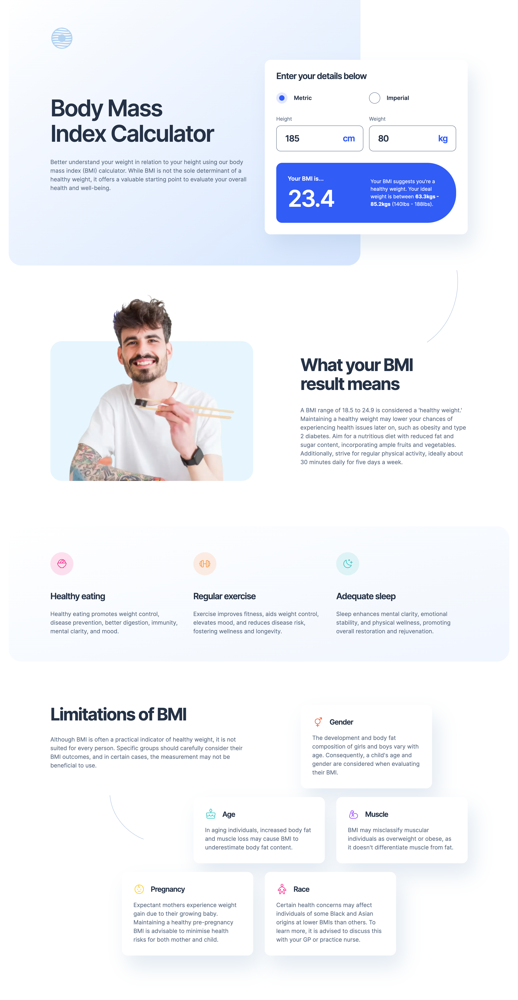

# Frontend Mentor - Body Mass Index Calculator solution

This is a solution to the [Body Mass Index Calculator challenge on Frontend Mentor](https://www.frontendmentor.io/challenges/body-mass-index-calculator-brrBkfSz1T). Frontend Mentor challenges help you improve your coding skills by building realistic projects.

## Table of contents

- [Overview](#overview)
  - [The challenge](#the-challenge)
  - [Screenshots](#screenshots)
  - [Links](#links)
- [My process](#my-process)
  - [Built with](#built-with)
  - [What I learned](#what-i-learned)
  - [Continued development](#continued-development)
  - [Useful resources](#useful-resources)
- [Author](#author)

## Overview

### The challenge

Users should be able to:

- Select whether they want to use metric or imperial units
- Enter their height and weight
- See their BMI result, with their weight classification and healthy weight range
- View the optimal layout for the interface depending on their device's screen size
- See hover and focus states for all interactive elements on the page

### Screenshots

|               Mobile designed at 375px:               |               Tablet designed at 768px:               | Desktop designed at 1440px:                            |
| :---------------------------------------------------: | :---------------------------------------------------: | ------------------------------------------------------ |
|  |  |  |
|                  Mobile (completed):                  |                  Tablet (completed):                  | Desktop (completed):                                   |
|        |      |        |

### Links

- Solution URL: [https://github.com/elisilk/bmi-calculator](https://github.com/elisilk/bmi-calculator)
- Live Site URL: [https://elisilk.github.io/bmi-calculator/](https://elisilk.github.io/bmi-calculator/)

## My process

### Built with

- Semantic HTML5 markup
- CSS custom properties
- Flexbox
- CSS Grid
- Mobile-first workflow
- Fluid typography
- Accessibility

### What I learned

Hmm 🤔 ...

- BMI - What is it? How do you calculate it?
  - [BMI Calculator](https://www.calculator.net/bmi-calculator.html)
  - [Calculate Your Body Mass Index](https://www.nhlbi.nih.gov/health/educational/lose_wt/BMI/bmi-m.htm)
  - [Body Mass Index (BMI)](https://my.clevelandclinic.org/health/articles/9464-body-mass-index-bmi)
  - [BMI Calculation Formula Explained](https://www.registerednursern.com/bmi-calculation-formula-explained/)
- Converting units in JavaScript - I looked at a few different options for this, but ended up using something very close to [what was explained in this Medium post](https://blog.probirsarkar.com/how-to-convert-length-units-in-javascript-with-ease-and-precision-895bc8b07393)
  - [How to Convert Length Units in JavaScript with One Simple Function](https://blog.probirsarkar.com/how-to-convert-length-units-in-javascript-with-ease-and-precision-895bc8b07393)
  - [How to convert imperial to metric units?](https://stackoverflow.com/questions/58187907/how-to-convert-imperial-to-metric-units)
  - [Convert centimetres to feet and inches](https://stackoverflow.com/questions/57940949/convert-centimetres-to-feet-and-inches)
- Converting units generally
  - [Google "71 inches in centimeters"](https://www.google.com/search?q=71+inches+in+centimeters)
  - [Pounds to kg conversion](https://www.rapidtables.com/convert/weight/pound-to-kg.html)
  - [Inches to CM Converter](https://www.rapidtables.com/convert/length/inch-to-cm.html)
- Overlapping grid items - This challenge had some surprisingly tricky layout patterns. I ended up relying on [CSS grid](https://developer.mozilla.org/en-US/docs/Web/CSS/CSS_grid_layout) a fair amount, especially to achieve the overlapping effects of the top section and the bottom section.
  - [There is a way to overlap grid-template-areas!](https://youtu.be/CVKbe4RaUZQ?si=lgxGyWLvKcaUgvCd)
  - [Why CSS grid-area is the best property for laying out content](https://youtu.be/duH4DLq5yoo?si=CmnF0hhPqA6OeIB9)
  - [Why grid-template-areas are amazing | #shorts](https://youtu.be/sYDQBfSQFRI?si=MVnqdIvOORxMlM2r)
  - [Overlap on the Web, Graphic Design Made Easy with CSS Grid](https://youtu.be/EashgVqboWo?si=9-b484qe4aArJ1Gb) and the [Experimental Layout Lab](https://labs.jensimmons.com/) more generally
  - [Overlapping Grid Items](https://mastery.games/post/overlapping-grid-items/)
- But I also used grid for a more general base layout approach. This was super fascinating to me. And in trying it out, I learned a lot about using [named grid lines](https://developer.mozilla.org/en-US/docs/Web/CSS/CSS_grid_layout/Grid_layout_using_named_grid_lines) and using [minmax](https://developer.mozilla.org/en-US/docs/Web/CSS/minmax) and [min](https://developer.mozilla.org/en-US/docs/Web/CSS/min) functions. Ultimately, I felt like the tricky layout made this general base layout not as useful as I would have hoped. But maybe I just need to get more experience with it and then would be better able to adapt it to more challenging situations.
  - [A new approach to container and wrapper classes](https://youtu.be/c13gpBrnGEw?si=-zSeo1cMeuZFwG_Q)
  - [Layout Breakouts with CSS Grid](https://ryanmulligan.dev/blog/layout-breakouts/) - and the associated CodePen below, which is super cool. I love the way it uses very general divs to explain the layout visually. And I also copied the `:checked` feature implementation in the challenge when showing and hiding the different unit input values.
    - [Layout Breakouts with CSS Grid](https://codepen.io/hexagoncircle/pen/dyejrpE)
- Accessible radio buttons - After looking over a number of solutions for this that I have considered in the past, I keep coming back to [Sara Soueidan's](https://www.sarasoueidan.com/blog/inclusively-hiding-and-styling-checkboxes-and-radio-buttons/) as the one I like the best. I like how the actual checkbox/radio button is not simply hidden, but is positioned directly on top of and covering the newly created checkbox/radio button and then hidden so that we "hide it visually but make sure it is still ‘physically’ present where it would naturally be present so that touch users can find it with haptics." And I love her video showing the impact of each line of the CSS one by one.
  - [Inclusively Hiding & Styling Checkboxes and Radio Buttons](https://www.sarasoueidan.com/blog/inclusively-hiding-and-styling-checkboxes-and-radio-buttons/)
  - [Create custom keyboard accessible radio buttons](https://www.a11ywithlindsey.com/blog/create-custom-keyboard-accessible-radio-buttons)
  - [One last time: custom styling radio buttons and checkboxes](https://www.scottohara.me/blog/2021/09/24/custom-radio-checkbox-again.html)
  - [Under-Engineered Custom Radio Buttons and Checkboxes](https://adrianroselli.com/2017/05/under-engineered-custom-radio-buttons-and-checkboxen.html)
- Container and media queries - I spent a good amount of time thinking about container queries as a way to specify the changes at different viewports. But in the end, it felt like for this challenge, most of the changes were better implemented as viewport media queries. But I still have container queries on my mind, so will look to use them where appropriate in the future.
  - [Using container size and style queries](https://developer.mozilla.org/en-US/docs/Web/CSS/CSS_containment/Container_size_and_style_queries)
  - [CSS container queries](https://developer.mozilla.org/en-US/docs/Web/CSS/CSS_containment/Container_queries)
  - [Using media queries](https://developer.mozilla.org/en-US/docs/Web/CSS/CSS_media_queries/Using_media_queries)
- [Border radius](https://developer.mozilla.org/en-US/docs/Web/CSS/border-radius) - I'm still not happy with my solution for the results `div`, but it seems good enough for now. I can revisit it at another time.
  - [Avoid elliptical shape in CSS border-radius](https://stackoverflow.com/questions/31617136/avoid-elliptical-shape-in-css-border-radius)
- [Using CSS gradients](https://developer.mozilla.org/en-US/docs/Web/CSS/CSS_images/Using_CSS_gradients)
  - [linear-gradient](https://developer.mozilla.org/en-US/docs/Web/CSS/gradient/linear-gradient)
- Section labels
  - [HTML section elements are a lie (sort of)](https://youtu.be/ULdkpU51hTQ?si=ofIPwN34HWvKUABL)
- [HSL in CSS](https://developer.mozilla.org/en-US/docs/Web/CSS/color_value/hsl)
- [innerHTML vs innerText vs textContent – What's the Difference?](https://www.freecodecamp.org/news/innerhtml-vs-innertext-vs-textcontent/)
- [HTML5: How to make a form submit, after pressing ENTER at any of the text inputs?](https://stackoverflow.com/questions/27807853/html5-how-to-make-a-form-submit-after-pressing-enter-at-any-of-the-text-inputs)
- [Decimal number regular expression, where digit after decimal is optional](https://stackoverflow.com/questions/12117024/decimal-number-regular-expression-where-digit-after-decimal-is-optional)
- Working with numbers in JavaScript
  - [Number.prototype.toFixed()](https://developer.mozilla.org/en-US/docs/Web/JavaScript/Reference/Global_Objects/Number/toFixed)
  - [How do you round to one decimal place in JavaScript?](https://stackoverflow.com/questions/7342957/how-do-you-round-to-one-decimal-place-in-javascript)
  - [How to convert a string to an integer in JavaScript?](https://stackoverflow.com/questions/1133770/how-to-convert-a-string-to-an-integer-in-javascript)
- [Create a blog with a headless CMS // Full 3-hour course // Astro + Wix Studio](https://youtu.be/Thudicbgqtg?si=pSEoO_J0FUnNlpRw) - Learned a ton of stuff about how to set up my base styles and overall how to think about the full project.
- [Using CSS custom properties like this is a waste](https://youtu.be/_2LwjfYc1x8?si=WJ1cSrkiD_YDIcUw) - I love this approach. Because the specific assets in this challenge already came in the appropriate color, I didn't find a use for the particular examples (customizing cards) from the video. But I did use the approach when creating a general "flow" class that could be customized with different spacing. And I hope to use the idea in the future.
  - [Custom properties with defaults: 3+1 strategies](https://lea.verou.me/blog/2021/10/custom-properties-with-defaults/)
- [The Clamp Calculator](https://royalfig.github.io/fluid-typography-calculator/) is always super helpful to me when defining my fluid typography and spacing. But for this challenge, I also looked at the [underlying code](https://github.com/royalfig/fluid-typography-calculator/) to understand how the JavaScript was implemented, and mirrored some aspects of that approach in my solution for this challenge.
- Form Validation - I continue to think about and try to implement more effective and efficient ways to process and validate forms. I especially get confused about how to process the [ValidityState](https://developer.mozilla.org/en-US/docs/Web/API/ValidityState) object without having just a bunch of if statements, but I feel like I am getting better at it.
  - [Form Validation Part 2: The Constraint Validation API (JavaScript)](https://css-tricks.com/form-validation-part-2-constraint-validation-api-javascript/) - I like this 4-part series.
  - [Different ways to iterate a NodeList and search for a specific element](https://medium.com/@byverdu/different-ways-to-iterate-a-nodelist-and-search-for-a-specific-element-2e4ee69c8d7f)
- [`<output>`: The Output element](https://developer.mozilla.org/en-US/docs/Web/HTML/Element/output) - Thanks to [@NikitaVologdin](https://www.frontendmentor.io/solutions/bmi-calculator-with-css-custom-properties-and-css-grid-layout-UbFReFXZFx#comment-67404460d54b5cb1def7afb3) for suggesting using this HTML element. I didn't know it existed, but it's definitely appropriate for this case, and [has accessibility advantages](https://developer.mozilla.org/en-US/docs/Web/HTML/Element/output#accessibility) over a `` element.

### Continued development

Specific areas that the solution should be improved (known issues):

- The linear gradient behind the hero text is clearly off. What am I missing about how to translate what is in the Figma design file into proper CSS code? It's clear that the lighter blue color is more present in the design compared to my solution, but I am not quite sure how to achieve that effect.
  - One option, a Figma plugin, [Figma Solid and Gradient to CSS](https://www.figma.com/community/plugin/1372671206451937478/figma-solid-and-gradient-to-css), which I tried and it did give me something, but it didn't seem to be much better, so I will have to keep playing with it.
- When focus changes to an input element, highlight all of the text in that element?
- The border radius for the results `div` don't seem quite right when switching to the desktop version with a slightly rounded corners on the left side and full on pill rounded corners on the right side. Specifying the right side at a very large value seems to impact the left side. I am not 100% sure why.
  - [`border-radius`](https://developer.mozilla.org/en-US/docs/Web/CSS/border-radius)
  - [Avoid elliptical shape in CSS border-radius](https://stackoverflow.com/questions/31617136/avoid-elliptical-shape-in-css-border-radius)
- Should boundary cases of BMI score be rounded before classified? For example, should a BMI score of 18.49 be rounded up to 18.5 (Optimum range) or down to 18.4 (Underweight)?
- Round values to what? A whole value? Maybe to the .5?
- The value "0" validates as true in the input text (numeric field), and it shouldn't. The value should have to be greater than 0, at least for the cm input. It's actually a little more complicated with the other inputs as there may be cases when a 0 is okay in the ft, in, st, lbs (and may be not terrible in the kg field either).
- Don't evaluate the validity of an input field if the user hasn't gotten to it yet. For example, no need to evaluate the weight field right after a user enters their height for the first time.
- When in imperial units, have the ideal weight range also output in imperial units (st and lb).
- Any refactoring of the code to be better organized and clearer? Inspiration of Wes Bos' gallery and slider.
  - [Building a Gallery](https://wesbos.com/javascript/10-harder-practice-exercises/58-building-a-gallery)
  - [Prototype Refactor of the Slider Exercise](https://wesbos.com/javascript/11-prototypes-this-new-and-inheritance/64-prototype-refactor-of-the-slider-exercise)
  - [Building a Slider](https://wesbos.com/javascript/10-harder-practice-exercises/59-building-a-slider)
  - [Prototype Refactor of Gallery Exercise](https://wesbos.com/javascript/11-prototypes-this-new-and-inheritance/62-prototype-refactor-of-gallery-exercise)

More general ideas I want to consider:

Hmm 🤔 ...

- I want to start doing my own more general layout explanations and CodePens similar to what Ryan Mulligan put together in [Layout Breakouts with CSS Grid](https://ryanmulligan.dev/blog/layout-breakouts/) and [the associated CodePen](https://codepen.io/hexagoncircle/pen/dyejrpE). I love the way it uses very general divs to explain the layout visually. And I also think adding the "Show grid lines" feature was super cool as well.
- I love the [The Clamp Calculator](https://royalfig.github.io/fluid-typography-calculator/) and would like to develop my own calculators (for other kinds of challenges) that work similarly.

### Useful resources

- [Accessibility Developer Guide](https://www.accessibility-developer-guide.com/)
- [MDN Web Docs for CSS](https://developer.mozilla.org/en-US/docs/Web/CSS) - Went here a lot to reference the different CSS properties and the shorthands, and all the great explanations about best practices.
- [MDN Guides](https://developer.mozilla.org/en-US/docs/Learn)
- [The Clamp Calculator](https://royalfig.github.io/fluid-typography-calculator/) - Used for all of fluid typography and fluid spacing calculations.
- [The Modern JavaScript Tutorial](https://javascript.info/)
- [Wes Bos - JavaScript Introduction](https://wesbos.com/javascript/01-the-basics/welcome) and other [courses](https://wesbos.com/courses)

## Author

- Website - [Eli Silk](https://github.com/elisilk)
- Frontend Mentor - [@elisilk](https://www.frontendmentor.io/profile/elisilk)
